# node-handbook

Lets learn node the node way! :dromedary_camel: :see_no_evil: :hatching_chick:


It's uncertain where this trek will take us, but we will try to strike a balance between instructional material, history, and philosophies on node, javascript, software, programming, engineering, communication, and tooling.

We may also cover a few other useful places to learn cool tools and skills like:

- html
- css
- git
- irc
- linux/unix (aka \*nix)
- app deployment
- people skills


> ```
·      + 　　 　 . 
　　　　· 　 · 　　.　 · 　　.　 
 ˚  +  *  . .  　.　 .  　 ˚  +  *  . 
 .  ⋆ 　　　 ˚ .　.🚀🐢🚀 . 
 + ✷   ✦  .     +  .  　　 　　　　
 　  +  .  ·  　  　 ✧ . 　 .
```
--- yoshuawuyts / Fishrock123 / substack


## TOC

<!-- TOC depth:1 withLinks:1 updateOnSave:1 -->
- [node-handbook](#node-handbook)
- [Getting started.](#getting-started)
- [What is javascript?](#what-is-javascript)
- [What is node?](#what-is-node)
- [How to get node](#how-to-get-node)
- [How to know node](#how-to-know-node)
- [Callbacks visualized](#callbacks-visualized)
- [Javascript the hard parts](#javascript-the-hard-parts)
- [... [WIP]](#-wip)
- [`npm` stuffs](#npm-stuffs)
- [Semver](#semver)
- [Node in the browser?](#node-in-the-browser)
- [Event Emitters](#event-emitters)
- [👻👻 Inheritance, Composition, and the Prototype Chain](#-inheritance-composition-and-the-prototype-chain)
- [Write your tests, eat your greens](#write-your-tests-eat-your-greens)
- [Whats the deal with Streams?](#whats-the-deal-with-streams)
- [Node.js and io.js Anthropology](#nodejs-and-iojs-anthropology)
- [Tools to write Node](#tools-to-write-node)
- [Spellcheck for Javascript](#spellcheck-for-javascript)
- [All the badges](#all-the-badges)
- [Hex Stickers](#hex-stickers)
- [An adventure of your own](#an-adventure-of-your-own)
- [JS is the worlds polyglot assembly language now](#js-is-the-worlds-polyglot-assembly-language-now)
- [ES6 and Beyond](#es6-and-beyond)
- [Frameworks](#frameworks)
- [Haters gonna hate](#haters-gonna-hate)
- [html + css](#html-css)
- [Community](#community)
- [Mastering git](#mastering-git)
- [Electron?](#electron)
- [Cool Cats writing Cool Modules](#cool-cats-writing-cool-modules)
- [People to watch](#people-to-watch)
- [Link Dump](#link-dump)
<!-- /TOC -->

## Required Provisions

* A computer :camel: (hopefully running a flavor of unix)
  * OS X will be easiest to use
  * Linux and windows are a bit more difficult
* Internet and a browser :globe_with_meridians:
* some time and interest :bow:

We will be acquiring items and tools along the way.

## How long is this adventure going to last?

Getting through all the material is going to take time.  Visit the places that seem most interesting, and don't get stuck on something you find boring or overwhelming.  Programming is [more fun and effective as a hobby](https://twitter.com/substack/status/586438480164589568) and you will learn more if you treat it that way.

Do take breaks and try to build something interesting.  Even if you fail, you will learn something.  Publishing your experiments feels good and creates breadcrumbs for others to learn from.

Don't go at it alone.  Be open to companions along the way.  Offer collaborative opportunity to others who may be seeking similar experience, and try to be willing to offer help and contributions to others when it seems appropriate and useful to both parties.

Don't live near anyone?


There is a vibrant and active community that is on-line at all hours of the day so you can remain isolated but still be connected with thousands of people.  Skip ahead to [#community](https://github.com/bcomnes/node-learnbook#community) to find possible avenues of interest, and places where you might meet other like minded people.

# Getting started.

Before we get started, we need to be somewhat prepared to face what lies ahead.  In order to communicate with the local populous you need to learn how to speak and think javascript.

## [Javascript for Cats](http://jsforcats.com)
If your a cat, like to have fun or learn like a cat, this will teach you the basics of javascript.

[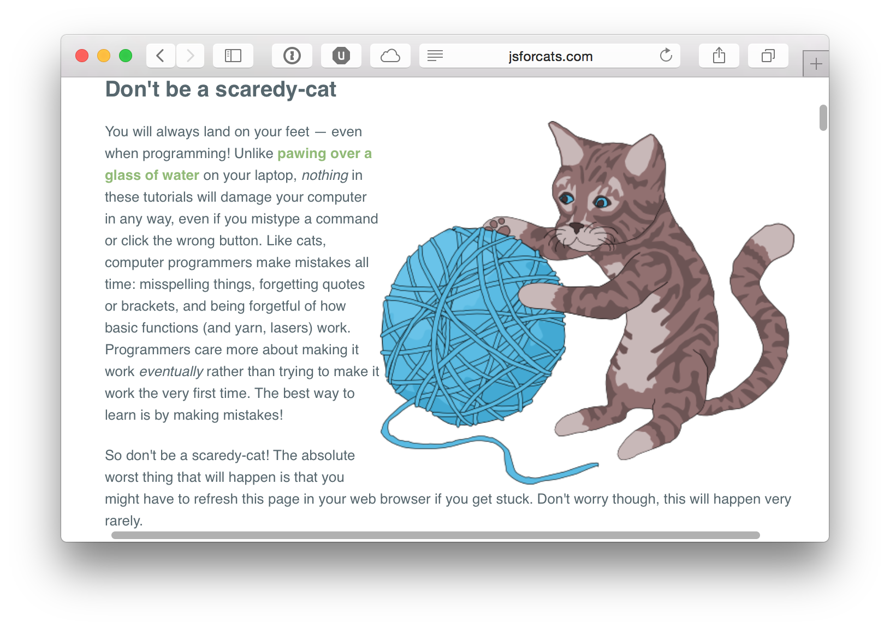](http://jsforcats.com)

## [Codecademy](http://www.codecademy.com/en/tracks/javascript)
If you tend to be a bit more serious, Codecademy's Javascript is also a good place to start.  Don't feel bad if you get bored and don't finish.  It's picking up the syntax that counts.

[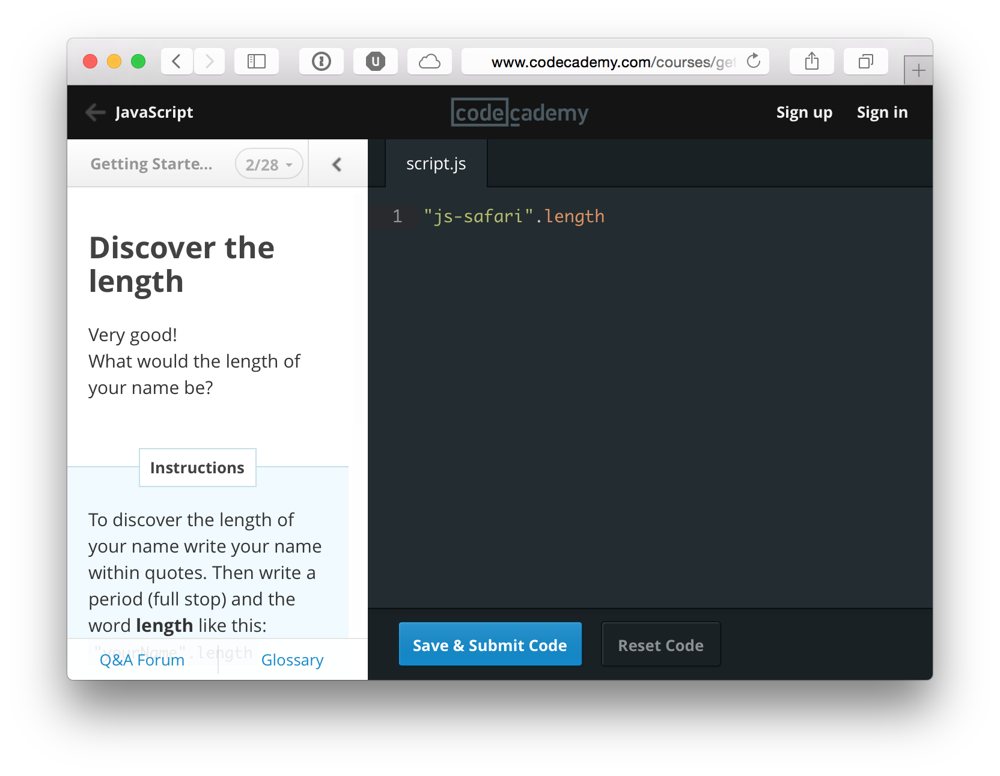](http://www.codecademy.com/en/tracks/javascript)

## [nodeschool.io: javascripting](https://github.com/sethvincent/javascripting)

We will revisit [nodeschool.io](http://nodeschool.io/) in the near future, but for now the `javascripting` nodeschool adventure is a good place to start learning javascript.  It may be a bit steep for absolute beginners.  Read through the [`get going`](http://nodeschool.io/#get-going) section to get up and running.

For those who know their way around `npm` already:

```sh
npm install -g javascripting

```

[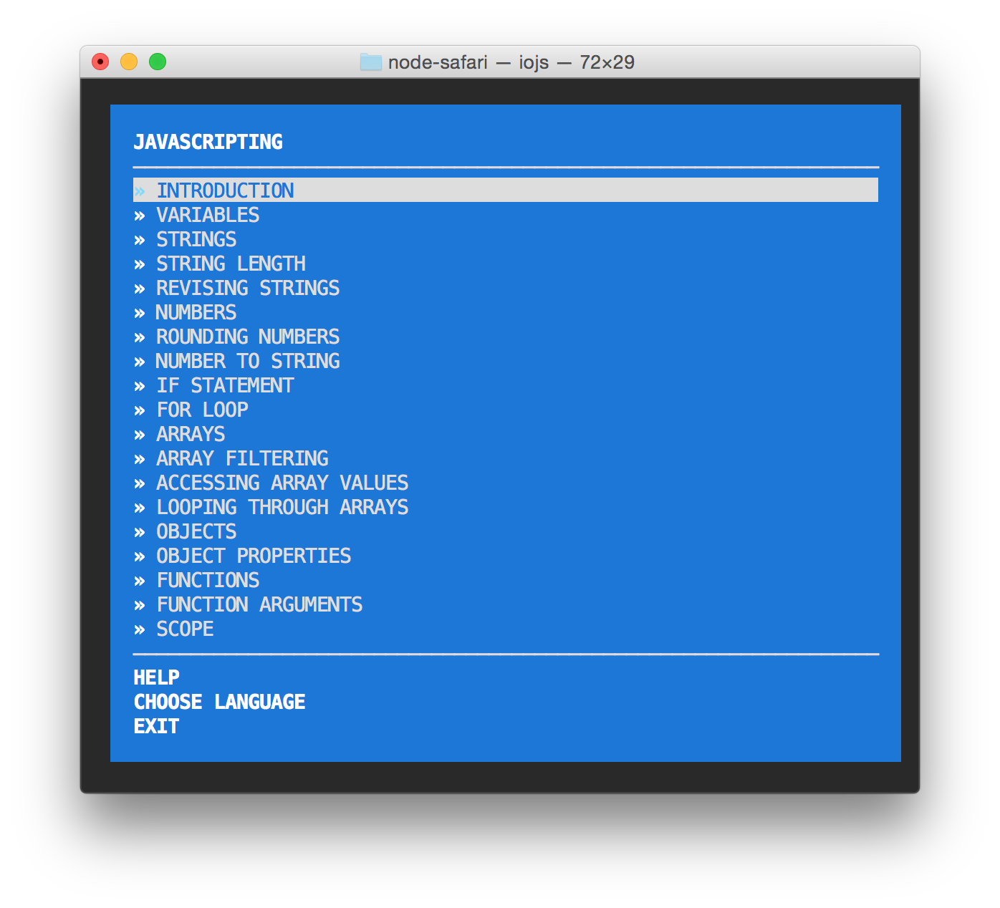](https://github.com/sethvincent/javascripting)

# What is javascript?

Javascript is the programming language that your web browser comes with, but these days its becoming a lot more.  Its pretty okay.  Its not the best language and has a lot of warts, but it gets a lot right, and you don't really have a choice about using it or not (although this is changing, for better or for worse).  You shouldn't skip learning javascript though.

It was invented by Brendan Eich in the days of the mosaic browser and netscape: [JSJ The Origin of Javascript with Brendan Eich](https://devchat.tv/js-jabber/124-jsj-the-origin-of-javascript-with-brendan-eich)

[](https://devchat.tv/js-jabber/124-jsj-the-origin-of-javascript-with-brendan-eich)

[Douglas Crockford](http://www.crockford.com) gave a good presentation that effectively answers the question: "What is Javascript?" in his 2012 "Javascript: Your New Overlord" presentation:

<figure>

<figcaption>
<a href="https://www.youtube.com/watch?v=Trurfqh_6fQ">
Javascript: Your New Overlord
</a>
</figcaption>
</figure>

You should watch it!

### ESWhat?

Also while we are on the topic, Javascript is the real world implementation of ECMAScript (abbreviated ES*, where * is the spec version), which is just a language specification e.g. a document that describes how it should work.

The current trend right now is to call the specs ES2015 (for ES6), ES2016 (for ES7) etc as a way to help promote quicker releases and access to newer language features.

More language features means more to learn for everyone.  The more everyone has to learn, the more intimidating starting out can be.

ES5 is a simple yet expressive language that we have right now.  Adding new features isn't guaranteed to improve the language (but there are quite a few welcomed features and data structures).  Be open about what to learn, and picky about what you choose to use.

You don't need to read these right now, but here are the last couple specs:

- [ES5](https://es5.github.io)
- [ES6 Draft (ES2015?)](http://people.mozilla.org/~jorendorff/es6-draft.html)
- [ES7 (ES2016?)](https://developer.mozilla.org/en-US/docs/Web/JavaScript/New_in_JavaScript/ECMAScript_7_support_in_Mozilla)
- [ES\* Compatibility Table](https://kangax.github.io/compat-table/es6/)
- http://www.bloomberg.com/graphics/2015-paul-ford-what-is-code/

# What is node?

Node was created by [Ryan Dahl](http://tinyclouds.org).  He has since pulled a [Mark Pilgrim](http://www.diveintomark.link) and [HTTP 410](http://en.wikipedia.org/wiki/Mark_Pilgrim#.22Disappearance.22_from_the_Internet)'d himself from the INTERNET, but occasionally will post interesting undocumented code projects to his [github](https://github.com/ry) or [post to the node mailing list](https://groups.google.com/forum/#!activity/nodejs/2JvBi5ikhDgJ).

The best way to understand what node is to listen to Ryan describe it himself.

[](https://www.youtube.com/watch?v=ztspvPYybIY)

[Ryan Dahl: Original Node.js presentation](https://www.youtube.com/watch?v=ztspvPYybIY)

[Ryan Dahl: Original Node.js presentation Slide Deck](doc/jsconf.pdf) (pdf)

[](https://www.youtube.com/watch?v=GhFrlX0LdFA)

[Ryan Dahl Talk - NodeConf Theatre 2012.ogv](https://www.youtube.com/watch?v=GhFrlX0LdFA)

[Ryan Dahl Talk NodeConf Theatre 2012 Slides](doc/nodeconf2012.pdf) (pdf)

## A few links about node's missing father

- https://news.ycombinator.com/item?id=4892174
- https://news.ycombinator.com/item?id=7064470
- http://shitryandahlsays.tumblr.com/
- https://www.youtube.com/watch?v=SAc0vQCC6UQ
- https://github.com/ry/v8worker
- http://siliconangle.com/blog/2012/01/31/how-a-vacuum-cleaner-salesman-became-the-new-king-of-node-js/
- http://www.quora.com/What-is-happening-to-Joyent-and-how-does-it-affect-NodeJS
- https://gist.github.com/cookrn/4015437

### What is Node: The Links

Some links discussing issues related to what node tries to solve and other general readings.  *Caution* some of these are overly advanced... maybe revisit these if the subject interests you.

- [About Node.js®](http://nodejs.org/about/)
- [A little holiday present: 10,000 reqs/sec with Nginx!](http://blog.webfaction.com/2008/12/a-little-holiday-present-10000-reqssec-with-nginx-2/)
- [The C10K problem](http://www.kegel.com/c10k.html)
- [Wikipedia: Event Loops](https://en.wikipedia.org/wiki/Event_loop)
- [Wikipedia: Asynchronous I/O](https://en.wikipedia.org/wiki/Asynchronous_I/O)

# How to get node

There are lots of ways to install node.  Lets visit some of the better ways of this contentious topic.

## In theory

Node needs the following two things to really work effectively:

### A build toolchain

A build toolchain is a complicated set of programs that let you build software from source.  Usually building software from source means building an executable binary from raw C and C++ source files and libraries.  Node needs a toolchain in order to build native addons (e.g. programs written in c that node modules sometimes needs to communicate with).

**Examples**

- [Xcode](https://developer.apple.com/xcode/)
- [Visual Studio](https://www.visualstudio.com/en-us/products/visual-studio-express-vs.aspx)
- [GNU GCC](https://gcc.gnu.org/)
- [CLANG](http://clang.llvm.org/)

### The node.js runtime

This is node iteself!  It provides things like the `node` command/runtime, and usually comes with `npm` bundled with it.


### Python2

Node requires python2 to build native addons.

### A general purpose package manager

A package manager is optional, but having one available and set up is extremely helpful.  Package managers install software for you, automatically and unattended.  They go out and download the programs you want, as well as the other programs required to run them, then take all the necessary steps to put them into the right place where you can use said programs.  Some people can't be bothered to use a package manager because you need to learn a little bit about how they work, but you will become a more powerful developer if you learn to use a traditional package manager.

**Examples**

- [homebrew](http://brew.sh/)
- [apt-get](http://manpages.debian.org/cgi-bin/man.cgi?query=apt&sektion=8)
- [yum](http://yum.baseurl.org/)
- [pacman](https://wiki.archlinux.org/index.php/Pacman)
- [chocolatey](https://chocolatey.org/)

## OSX

<a href="https://jamesfriend.com.au/pce-js/"></a>

The only prerequisite to installing node is that you have a copy of [Xcode](https://itunes.apple.com/us/app/xcode/id497799835?mt=12).  Its free and the only place to get it is from App store (boooo).  This fills the toolchain requirement on the OS X side of things.

<a href="https://itunes.apple.com/us/app/xcode/id497799835?mt=12">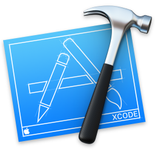</a>

OSX Terminal.app is pretty great for everything you need to do (although historically it used to suck).  Just use OSX's terminal unless you have a reason not to.

<a href="https://en.wikipedia.org/wiki/Terminal_(OS_X)">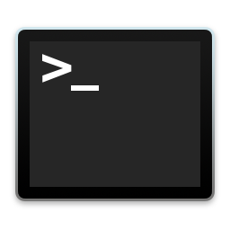</a>

There are two great options to install `node` on OSX: Homebrew and the Official Installer.

### [Homebrew](http://brew.sh)

<a href="http://brew.sh"></a>

Homebrew is a lightweight package manager for OS X.  Homebrew:
  - downloads and installs Unix CLI programs from source code
  - keeps track of which programs you installed and at what version
  - updates your programs when updates are available
  - download non-npm programs and utilities

Until npm has packages for all external dependencies, having `brew` installed can be really helpful.
s
Visit the [Homebrew](http://brew.sh) website for the latest instructions on how get
`brew` installed.

Once you have homebrew installed installing node is as easy as running:

```sh
$ brew install node
```

To get new releases of node in the future download run:

```sh
$ brew update
$ brew upgrade node
```

Easy.

A quick brew `101` so that you know what you just did:
  - `/usr/local` is a special unix folder where 'userspace' (e.g. not managed by the OS)programs can be safely installed.  Since homebrew was installed by the user by hand, it is a userspace program.
  - Homebrew turns `/usr/local` into a git repo
  - `brew` uses "Formula" written as simple ruby scripts to download, build and install programs to `/usr/local/Cellar`
  - The active version of a program installed by `brew` is symlinked to `/usrlocal/{binlib,...}`
  - `brew update` updates the `/usr/local` repo so that you have the latest 'Formula' available.
  - All Formula can be built from source, but most have precompiled 'Bottles' (a.k.a binaries) to save time and battery power.
  - Old versions of programs can be installed by going back into the git history.

A few more links discussing the merits of homebrew:
  - [to install node via Homebrew or not?](http://www.reddit.com/r/node/comments/37ui2to_install_node_via_homebrew_or_not/)

### [The official node installer `node-v*.pkg`](https://nodejs.org/download/)

[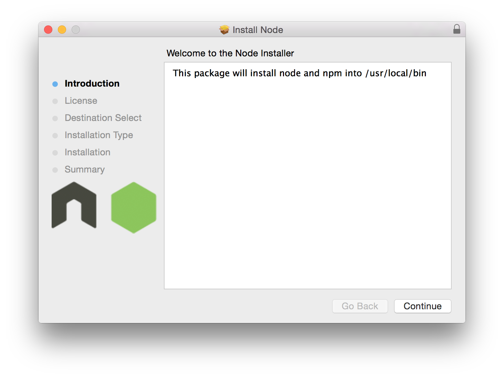](https://nodejs.org/download/)

Easy.  You go to the node website, you [download the .pkg](https://nodejs.org/download, and install it.  It installs to the same location that homebrew installs to: `usrlocal/bin`.

## Linux

Running Linux? (:+1: btw)


Don't just reach for your systems package manager!

Linux distributions almost universally ship painfully dated versions of node and npm (unless you are running something like [Arch Linux](https://www.archlinux.org)), and install them in ways that make them a total pain to use for the sake of 'stability'.

This sucks.

Luckily there is a comprehensive resource on how to add software channels that have updated versions of node to common package mangers:

[Installing-Node.js-via-package-manager](https://github.com/joyent/node/wiki/Installing-Node.js-via-package-manager)

Basically it boils down to this:

### Add an updated node repo to your package manager

- [nodesource/distributions](https://github.com/nodesource/distributions)

Your linux distribution will dictate which package manager you use.

### Configure npm to `-g` into `/usr/local` and fix permissions

Don't sudo with npm!  (even -g).  Set up `npm` so that it works without sudo:

[Fixing npm permissions](https://docs.npmjs.com/getting-started/fixing-npm-permissions)

Setting `npm` to install to `/usr/local` is the correct place for `npm` to install global library binarys to.  It is in all user path's by default, and is the conventional well known location to look in.

If you are stuck in userland on a shared system and you don't have permissions to modify `/usr/local`, you can configure `npm` to install `-g` libs right into your home directory and add the resulting folder to your $PATH.  Only do this if you don't have access to `/usr/local`.

## Windows

> Windows is very important.  Just like PHP
-- [Ryan Dahl](https://youtu.be/jo_B4LTHi3I?t=56s)

[](http://nodejsreactions.tumblr.com/post/113606988159/corporates-attempting-to-woo-developers-jumping-on)

On windows, pretty much stick with the official installer:

[Official Installer](https://nodejs.org/download/)

There are a few package managers on windows which you are free to explore on your own time:

- [Chocolatey](https://chocolatey.org)
- [Scoop](https://github.com/lukesampson/scoop)

Windows support for node is pretty good.  Windows support for most npm modules is pretty bad.

You will also need to install a free version of Visual Studio for building modules that have native addons:

[Visual Studio Express](https://www.visualstudio.com/en-us/products/visual-studio-express-vs.aspx)

as well as python2 installed:

[python2](https://www.python.org/downloads/)

For up to date windows caveats, see [Microsoft/nodejs-guidelines](https://github.com/Microsoft/nodejs-guidelines)

# How to know node

Now that we have seen a bit about the history and motivations behind node, lets actually visit the necessary materials to actually understand node.

## [The Art of Node](https://github.com/maxogden/art-of-node#the-art-of-node)

[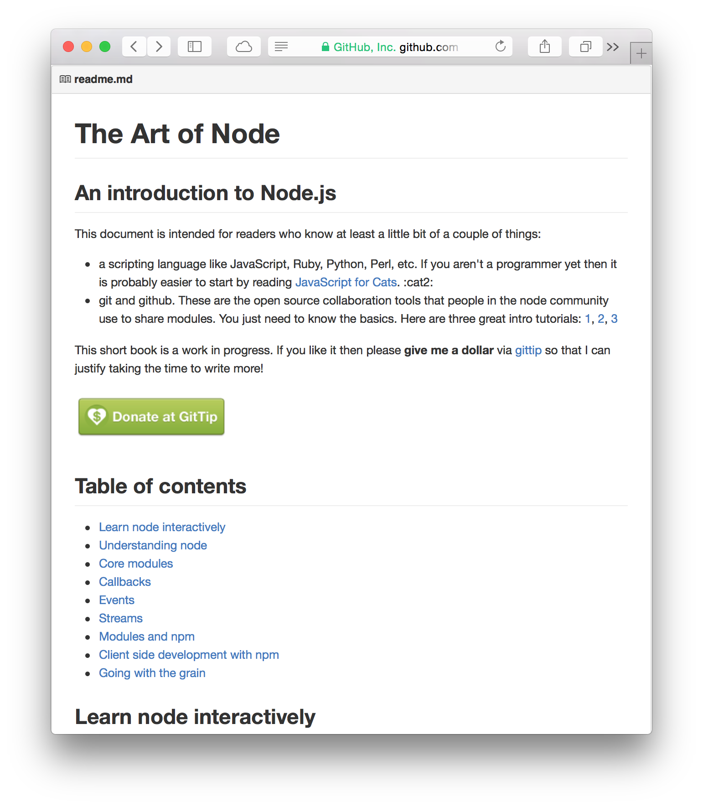](https://github.com/maxogden/art-of-node#the-art-of-node)

Written by [Max Ogden](http://maxogden.com),


*An image of Max holding a bag of fish for some reason.  Probably to lure cats. Image by [substack](http://substack.net/art)*

[maxogden/art-of-node](https://github.com/maxogden/art-of-node#the-art-of-node) gives a thorough explanation of how node works, how to write node flavored javascript, callbacks and async programming, writing and using modules and how to be apart of the node/js community and do your best.  Its full of insight and clear reasoning, but when you are new to js and/or node, all of the subtleties can fly by pretty quickly.  **It's a short and easily digestible read, that you should probably read through a few times**.

## [Node.js in Action](http://www.manning.com/cantelon/)

[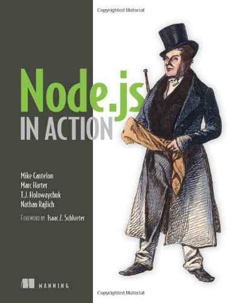](http://www.manning.com/cantelon/)

([2nd Edition Coming Soon](http://www.manning.com/cantelon2/))

Written by a group of early prolific node.js module developers, this book is *totally great* and *somewhat flawed*, and a bit dated at this point as well.  It has a great set of examples though, and it's "hello world" app is the well-known [socket.io](http://socket.io) chat server.

It covers the basics of all the well known [Visionmedia](https://github.com/visionmedia)  modules (e.g. [express](http://expressjs.com), [mocha](http://mochajs.org), [connect](https://github.com/senchalabs/connect#readme), [jade](http://jade-lang.com), [ejs](http://www.embeddedjs.com) etc...).  You will learn to use all of these early node tools, including core node modules, async programming, testing, templating, CLI programs, and even node clustering from this book through the various included projects and examples.

Despite the fact that many of the modules discussed have changed their APIs, this is still a great reference and useful for learning node.

Unfortunately, this great collection of knowledge is tombed away in a book (*we should change that though*).  Get the book if you can.

**What this book does well:**

- Introduction to node, events async programming and flow control
- [socket.io](http://socket.io) examples
- npm modules: publishing and consuming
- Module resolution and loading (a.k.a. [require('foo')](https://nodejs.org/api/modules.html#modules_module_require_id))
- http
- ORMs and Databases
- Middleware and [Connect](https://github.com/senchalabs/connect)
- [Express](http://expressjs.com) photo hosting and microblogging app
- Testing (mostly Mocha)
- EJS and Jade templating
- Node application deployment
- System Calls
- Raw TCP/IP
- CLI Tools

Focus on the first and last 1/3 of the book, and don't sweat the middle 1/3rd (express/connect).

## [Nodeschool.io](http://nodeschool.io/)

<a href="http://nodeschool.io/"></a>

Nodeschool is a free resource that offers lessons and tutorials on tons of topics, mostly relating to node and js.  The key is that the lessons are written for `node` and you install them with `npm` (usually).

They were designed to be taught at community events around the world, but you can learn on your own at home if there isn't an event going on nearby.

### [Node School Core](http://nodeschool.io/#workshopper-list)

Start with [learnyounode](https://github.com/workshopper/learnyounode) which can be installed with

```sh
npm i -g learnyounode
```

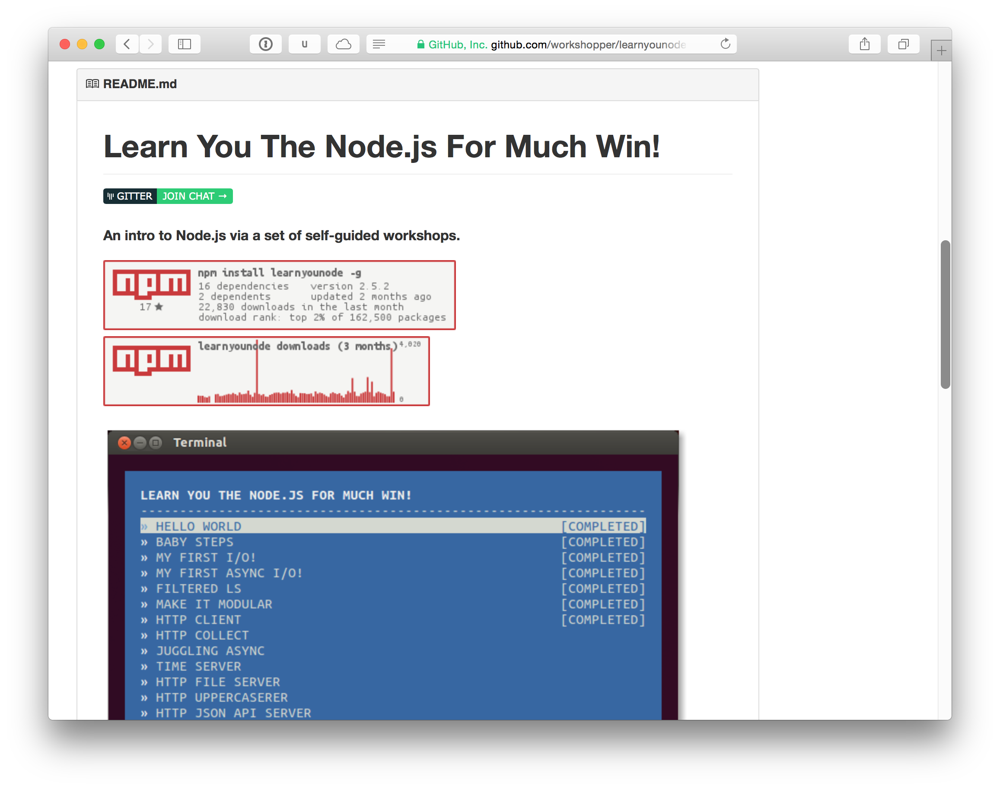

(No, not [learnyouhaskell](http://learnyouahaskell.com/), that lives on a different planet)

After this, brush up on your `git` in `git-it`:

```sh
npm i -g git-it
```

Git is a super important tool to know, use and love.  Its like a checkpoint system in a video game but for text files on your computer.  Check all of your projects into git, and throw them up on github.  It's a great way to publish your work, and keeps a backup of everything you do!

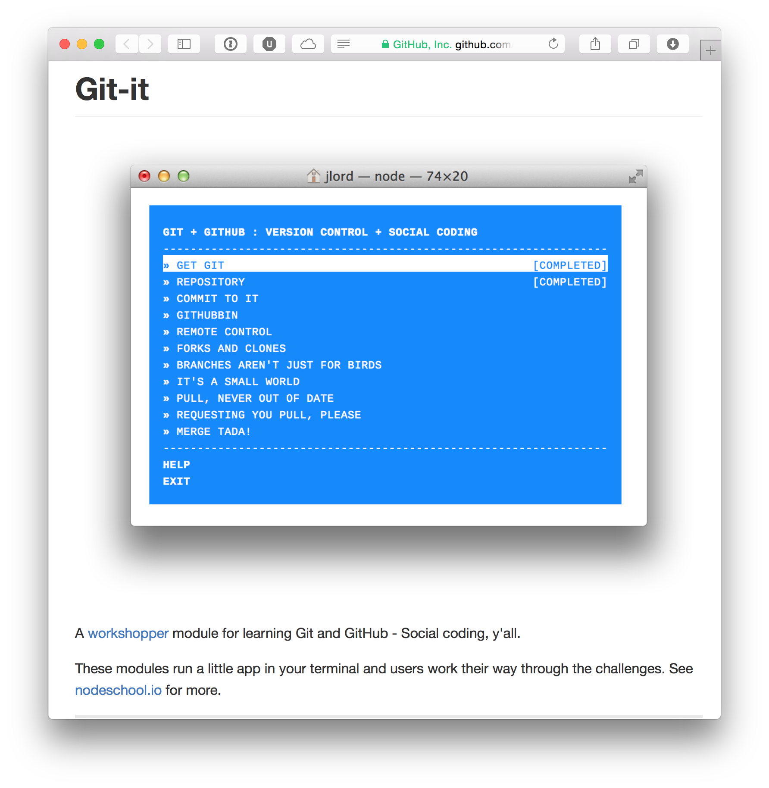

Finally, wrap your head around `npm`


```sh
npm i -g how-to-npm
```

`npm` is node's package manager.  Its like [`pip`](https://pypi.python.org/pypi/pip), [`gem`](https://rubygems.org/) or [`cabal`](https://www.haskell.org/cabal/) for javascript.

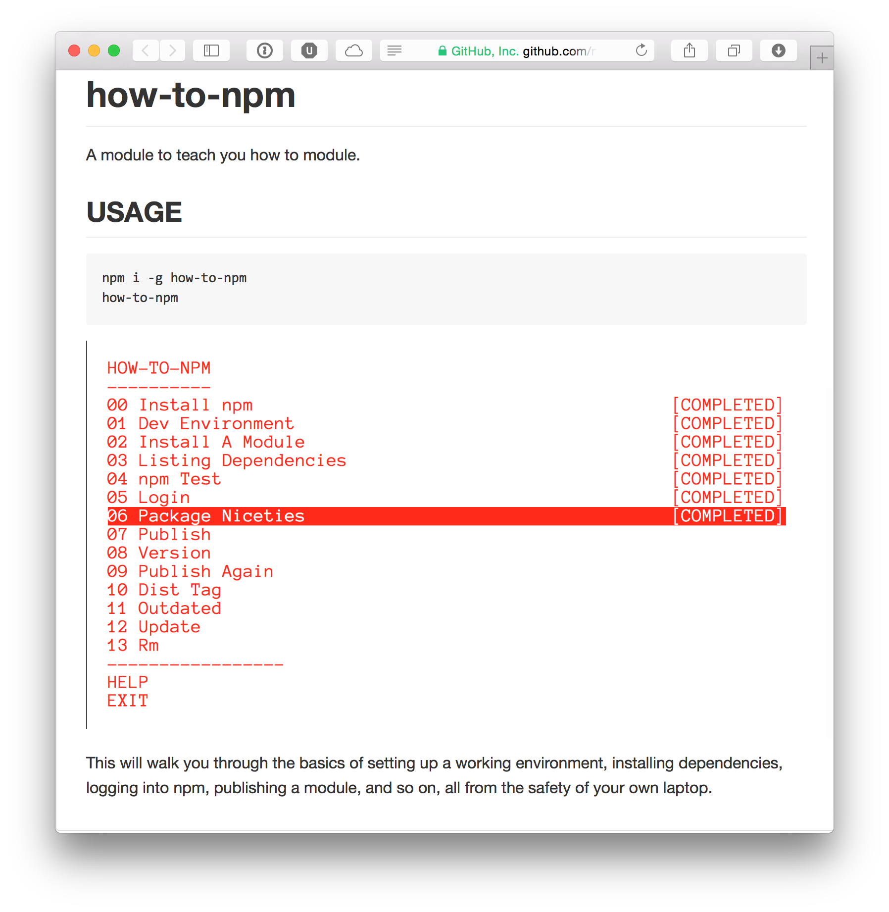

# Callbacks Deconstructed

TODO: Lets get a bunch of super simple examples of callbacks and work our way up to understanding what runs async and what doesn't all the way up to `process.nexTick()`.

## More reading

- http://nrn.io/view/javascript-common-pitfalls
- http://neversaw.us/2014/12/20/classifying-asynchrony/

# Callbacks visualized

Callbacks are confusing at first, because you are writing functions that accept variables that seemingly come out of nowhere.

These variables that your callback accepts come from the internals of the function accepting the callback function!

Before we get into it, remember:

- Async functions return immediately
- If your code needs the results of an async function, that code needs to live in the scope of that async function's callback.
- Code that comes after an async function must complete before the async function calls its callback function.  This the "Run to completion" guarantee.
- Functions that take a callback must be async or not async.  Don't write a function that takes a callback that does not perform async work as this will break the "Run to completion" guarantee.
- [You can't `return` values from an async callback like you might think.](http://nodejsreactions.tumblr.com/post/56341420064/when-i-see-some-code-that-returns-a-value-from-an)

Lets take a look:

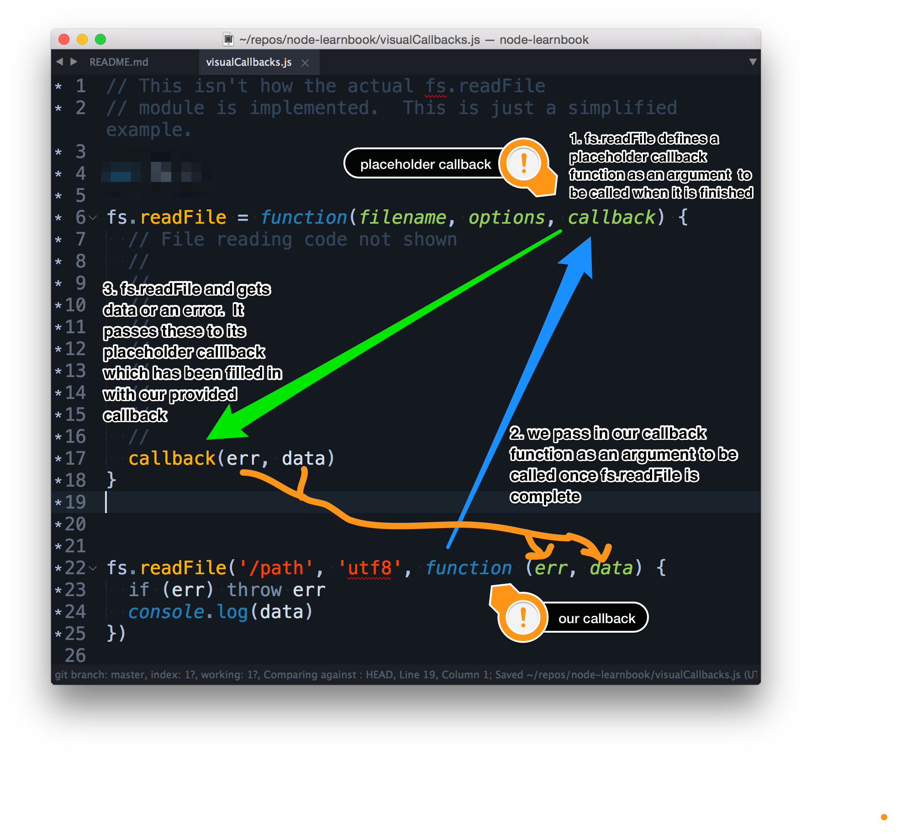

1. First, we define `fs.readFile`.  Typically you import this as a module (e.g. `var fs = require('fs')`), but for this example we want get an idea of what is going on internally.  The code to actually read files is omitted, but at the end of the function we see that the `callback` argument is invoked as a function (e.g. `callback(err, data)` where the `err` and `data` variables would be defined inside the function somewhere when reading the file.)

2. Next we invoke `fs.readFile` passing in a string containing the path to the file we wish to read, encoding options, and a callback function that accepts `err` and `data` arguments to match the arguments that the `callback` placeholder defines in step 1.  The file is read and the placeholder callback is replaced with our callback function that we passed as an argument.

3. After `fs.readFile` is done trying to read the file, it calls our callback function, passing to it `err` and `data` as arguments and our callback function then begins execution.  If there was no error when reading the file, `err` will be `undefined`/falsy so we can easily test for errors and handle them, or pass them along.

Lets clean it up a little.

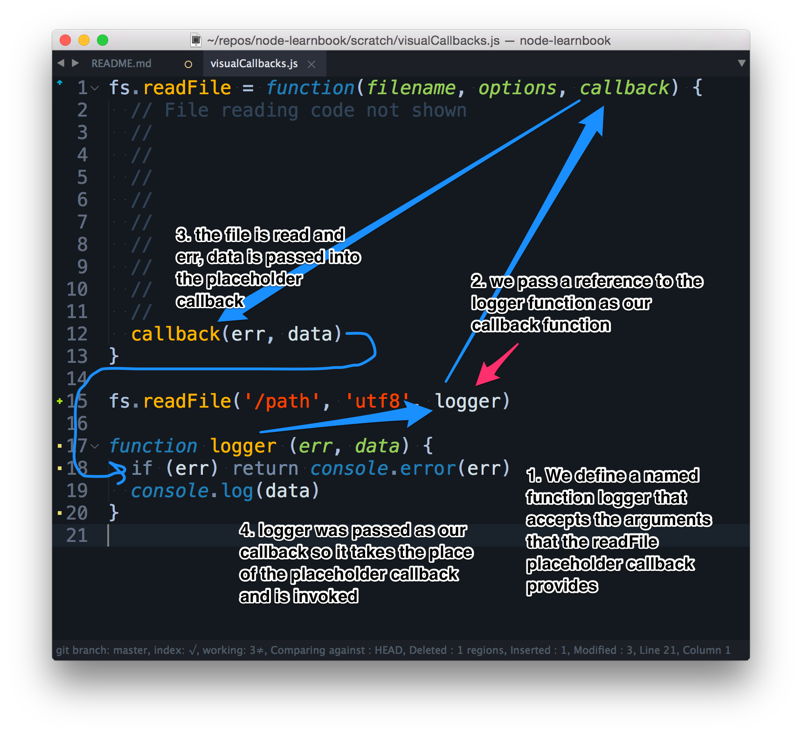

We replace the anonymous function with a named function `logger` that we pass as the callback.  It's nearly the exact same thing as the first example, except now the function can be implemented independently from where we invoke fs.readFile.

Ok, so it's not always practical to go digging around the internals of a module to locate the callback signature (e.g. the arguments) that it expects of your callback.  This is where the module's `README.md` comes in.

How did we know `fs.readFile` expects a callback with `(err, data)` arguments?  We look it up!

**[node.js API docs: fs.readFile](https://nodejs.org/api/fs.html#fs_fs_readfile_filename_options_callback)**

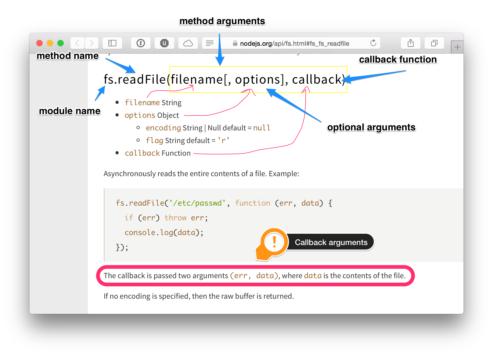

Modules should come with a `README.md` with similar documentation.  If it doesn't have this, maybe look around for one that does.

We can write our own callback functions just as easily.

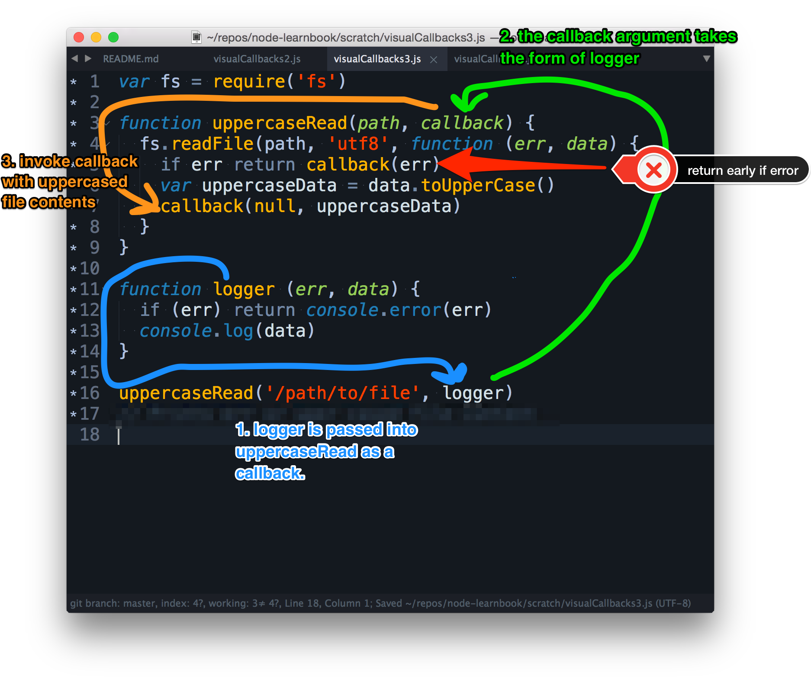

Here we write an async function that wraps the fs.readFile async function.

We write a function that accepts a callback as the last argument.  We do some asynchronous work inside of it, modify the output and then pass it into our callback.

Easy!

Well, in theory.  Callbacks take a bit of practice, but hopefully we can visualize callback flow and how variables and functions are passed around.

## Callback you later

You can read more about callbacks, but the best way to learn how to use them is to read and write lots of them!  While your doing that, peruse through these lovely links.

- [maxogden/art-of-node#callbacks](https://github.com/maxogden/art-of-node#callbacks)
- [callbackhell.com](http://callbackhell.com/)
- [Why callback hell can be your friend.](http://jondavidjohn.com/why-callback-hell-can-be-your-friend/)
- [Node In Action: 3.2 Asynchronous Programming Techniques](#nodejs-in-action) p.46
- [Eloquent Javascript: Http callbacks](http://eloquentjavascript.net/17_http.html#p_8Shcg3/WzI)

## I Promise

- https://blog.domenic.me/youre-missing-the-point-of-promises/
- http://www.slideshare.net/domenicdenicola/callbacks-promises-and-coroutines-oh-my-the-evolution-of-asynchronicity-in-javascript
- https://github.com/petkaantonov/bluebird#what-are-promises-and-why-should-i-use-them
- https://spion.github.io/posts/why-i-am-switching-to-promises.html

# Javascript the hard parts

Javascript is easy to learn, but hard to master.  It's a flawed language with lots of subtle pitfalls to be navigated.  These materials will help you master the more subtle and difficult aspects of the language.


##  [Nodeschool.io](http://nodeschool.io/): Tie it all together

If you haven't already, finish up the core nodeschool workshops.  The last two are the most conceptually difficult:

`scope-chains-closures` teaches you all about scopes and closures!

```sh
npm i -g scope-chains-closures
```

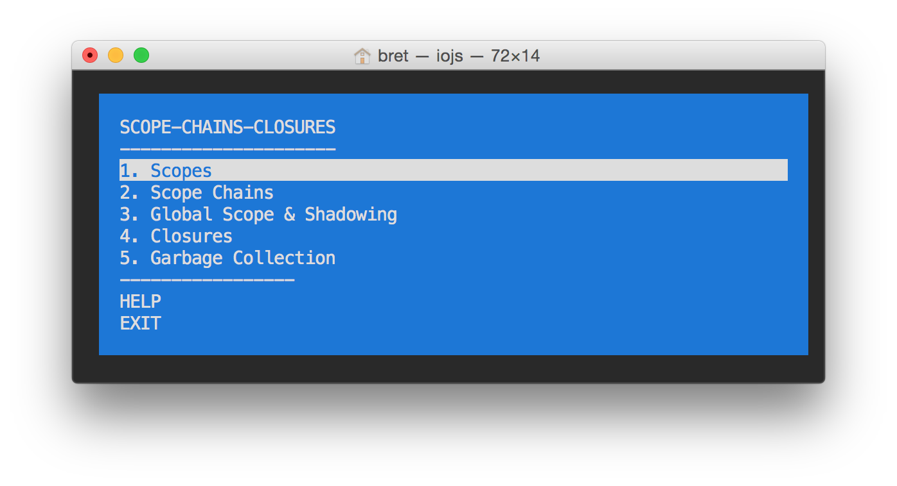

`stream-adventure` teaches you about streams.  This is a good place to start, but will leave you with a lot of questions.

```sh
npm i -g stream-adventure
```

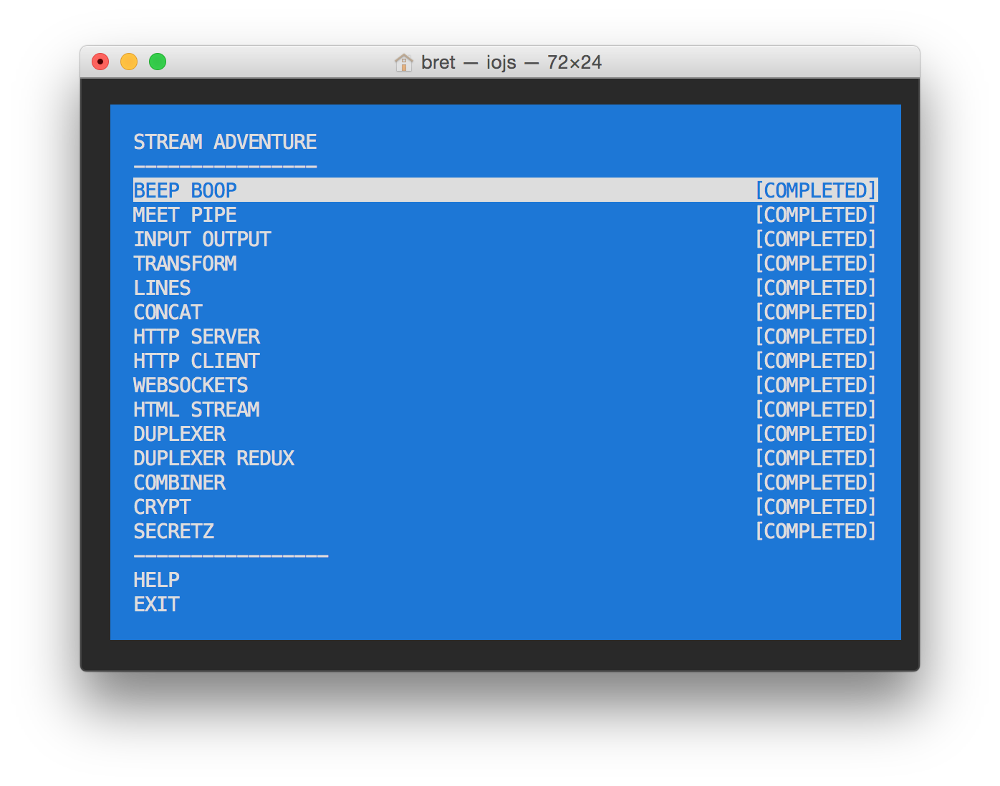

## [Effective Javascript](http://effectivejs.com)

[](http://effectivejs.com)

**REQUIRED READING**

[Effecitve Javascript](http://effectivejs.com) is an excellent book focusing only on Javascritpt the Language.  It has answers and clarifications for the more confusing aspects of the languages, explains the prototype chain in a clear way, and covers the more advanced aspects of JS.  The only downside is the cost of the book. A+

## [Eloquent Javascript](http://eloquentjavascript.net)

[](http://eloquentjavascript.net)

This is a free e-book (paper version is available too).  It seems to reside somewhere between [Effective Javascript](#effective-javascript) and [Node.JS in Action](#nodejs-in-action) with an environment agnostic approach to writing javascript.  It has a lot of projects in it that run closer to your more traditional programming textbook.

## [Javascript: The Good Parts](http://www.amazon.com/exec/obidos/ASIN/0596517742/wrrrldwideweb)

<a href="http://www.amazon.com/exec/obidos/ASIN/0596517742/wrrrldwideweb"></a>

JSTGP is one of Douglas Crockfords claim to fame (he also wrote down the [JSON](http://json.org) spec). It's pretty old at this point, and a difficult, dense and terse read.  But its still really good, and has one of the better explanations about the different styles of object composition and inheritance (AKA Object Oriented Programming... or something kind of like it):

### JSTGP:The good parts

- Pseudoclassical Inheritance
- Prototypal Inheritance
- Functional Inheritance
- Talking about the bad and awful parts of js is straightforward and interesting.
- Setting the expectation of critical understanding and critique of different aspects of Javascript.

### JSTGP:The bad parts

- The train track diagrams, while correct, literally don't help you think or understand how to write better JS.  You get as much out of it as a you do completing a maze.
- The regex stuff might confirm your understanding, but don't try to learn regex from this book.
- Its discussion on callbacks.  It doesn't even give one good example!  It was written before JS was widely known for its ability to perform cooperative multitasking.

You will no doubt have questions about some of the suggestions in the book.  It was written as [ES5](https://es5.github.io) was still not widely available.  Quite a few of the polyfills noted in the book are actually widely available functions and methods... so double check [MDN](https://developer.mozilla.org/en-US/) to see if its just a built in function now.

# `npm` stuffs

<a href="https://www.npmjs.com/"></a>

`npm` is a package manager.  If you have something (anything!) that could be apart of a larger project, you should version it and put it on `npm`.  Its *the* package manager for javascript, and is becoming the package manager for HTML and CSS components.

tl;dr `npm` helps you download dependencies and publish reusable pieces of code/assets/software.

## How do I use `npm`?

In addition to the [how-to-npm](#node-school-core) nodeschool adventure, `npm` has a great getting started page:

[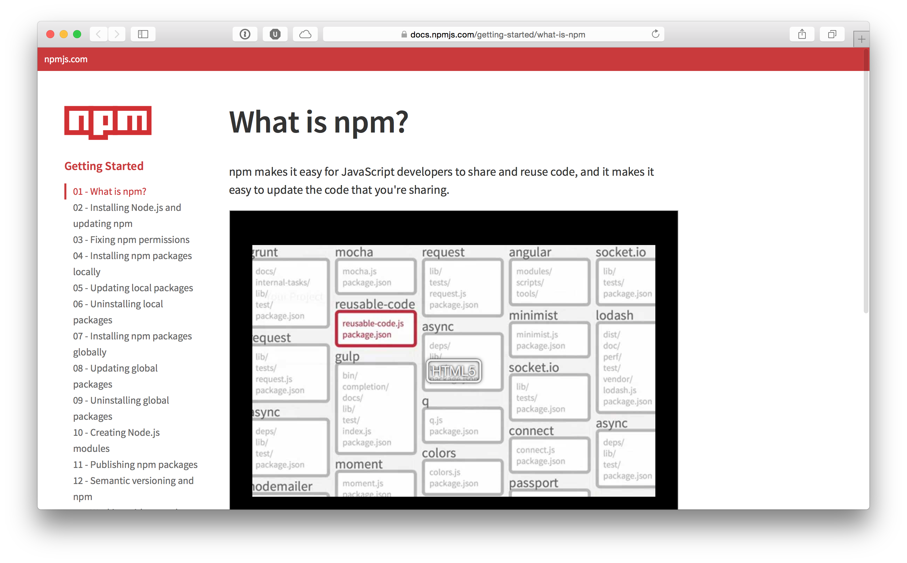](https://docs.npmjs.com/getting-started/what-is-npm)

- [npm getting started](https://docs.npmjs.com/getting-started/what-is-npm)

But here are the short notes version:

### Using `npm` to start a project of your own

```
$ mkdir newproj ; cd newproj
$ git init
$ npm init
```

As we develop and use modules, we save them with:

```sh
$ npm i request --save
# e.g. install the request module and save it to package.json
```

When you are finally ready to put it out into the world

```sh
$ npm publish
```

### `npm` with existing projects

If you clone in a project with a `package.json`, typically this is where you start:

```sh
$ git clone project@url.git ; cd project
$ npm i
# i is short for install
# `npm install` would also work
```

This is downloads the dependencies of the project into a folder called `node_modules`.  The `node_modules` folder should be added to your `.gitignore` file.

A good next step is to test the project:

```sh
$ npm test
# this tests the module
```

Tests help ensure that others can help make changes and contributions the the module.  There are no automated module interface testing tools, so project specific tests are the best thing we have right now.

Often you can start the module by running.

```sh
$ npm start
```

Finally, we can inspect other actions that project author added to the `package.json` `scripts` field:

```sh
$ npm run
```

This lists of other actions we can take on the module.

## What *IS* `npm` really?

`npm` is arguably more interesting than node itself:

`node` is a tiny V8 javascript runtime engine with bindings to a set of high performance asynchronous `C` libraries.

`npm` is a system for authoring, packaging, and consuming reusable bits of code and assets, AND the worlds largest open source software repository:

<a href="http://www.modulecounts.com">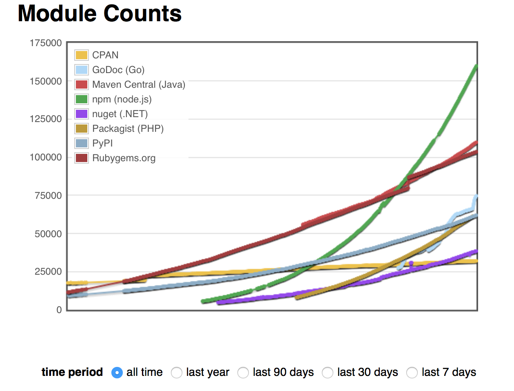</a>

It's analogous to a lego machine that produces unlimited copies of whatever kind of lego you can think of.

> I want programming computers to be like coloring with crayons and playing with duplo blocks. --[Ryan Dahl](https://news.ycombinator.com/item?id=4310723)

`npm` works better when using it when modules are small, focused bits of code that solve one problem well (instead of kitchen-sink, do-all modules).

- [docs.npmjs.com: What is npm?](https://docs.npmjs.com/getting-started/what-is-npm)
- [Understanding npm](https://unpm.nodesource.com/)

[](https://unpm.nodesource.com/)

## Why is `npm` different than {gem,pip,bundler,cpan,etc}?

`npm` does a few things differently:

### Local packages by default

When you `$ npm install` a package with `npm`, it installs to the `node_modules` folder specific to your project.

In nearly every other programming language, the package manager installs to a system wide (or user wide) dependency folder that all projects use.  This runs into all sorts of permission errors and complexities that make it difficult to write software.  Local-by-default `node_modules` solve:

- Permission errors when users without admin access try to install project dependencies.
- Inconsistent and opaque module loading directories.
- Cognitive disconnect and confusion of where your modules are loading from.
- Eliminates the need for `$ENV` variables.

System wide dependency repositories are **Global Variables**.  Nearly every language has systematic hacks to get around this issue like [bundler.io](http://bundler.io/) and [virtualenv](https://virtualenv.pypa.io/en/latest/). None of these actually solve the problem that local-by-default `node_module` solves.

This is an important concept. Read more about it here:

<a href="https://github.com/maxogden/art-of-node#how-require-works">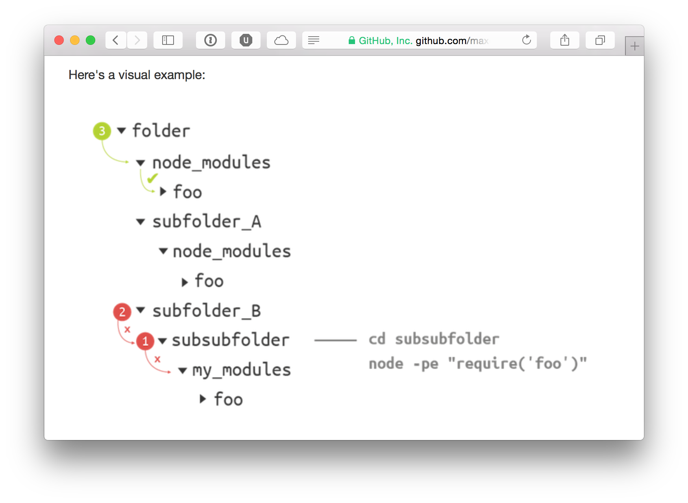</a>

- [art-of-node: How `require` works](https://github.com/maxogden/art-of-node#how-require-works)
- [Folder Structures Used by npm](https://docs.npmjs.com/files/folders)
- [Node API Docs:#modules_loading_from_node_modules_folders](https://nodejs.org/api/modules.html#modules_loading_from_node_modules_folders)
- [Node.js In Action: (p.43) Reusing modules in the node_modules folder](#nodejs-in-action)


### Nested dependencies by default

In most languages, if you depend on dependency `A@2.0` and `B@1.0`, and `B@1.0` depends on `A@1.0`, you are in [dependency hell](https://en.wikipedia.org/wiki/Dependency_hell).  You are unable to satisfy your dependency tree in a way that functions.

Node and `npm` allow for nested dependencies.  That means, your app gets `A@2.0` and `B@1.0` gets `A@1.0`.

[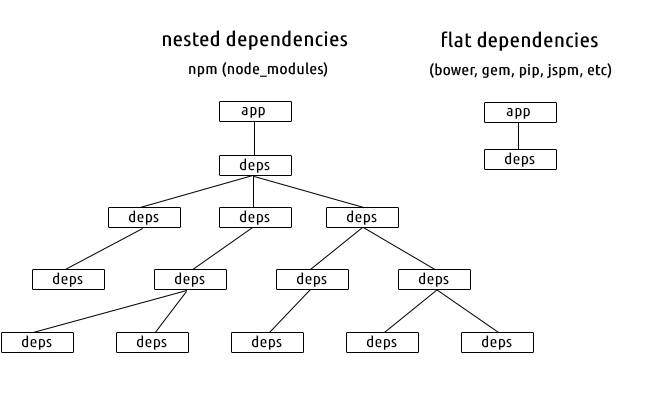](http://maxogden.com/nested-dependencies.html)

How does this magic work?  See:

- [Nested Dependencies](http://maxogden.com/nested-dependencies.html)
- [node packaged modules](http://maxogden.com/node-packaged-modules.html)

Nested dependencies solve the following issues:

- Dependency hell: Every dependency gets the dependencies it wants at the version it wants.
- Allows you to update your dependencies without worrying about breaking consumers of your module.
- Allows dependencies to update their dependencies without worry of breaking your module.
- Breaks undefined ties to global version state.

Nested dependencies introduce considerable complexity, and work is ongoing to improve its reliability. See what `npm@3` is doing to improve this: [npm@3.0.0 cangelog](https://github.com/npm/npm/releases/tag/v3.0.0).

### Encourages experimentation through module diversity

Many languages discourage the publishing of reusable code through various roadblocks (but primarily cultural ones).

`npm` encourages publishing as much as possible.  Publishing a module is a single command, and mostly automated.

This is unprecedented.

As a result, there are tons of bad modules.  There are lots of good ones too.  This solves the following issues:

- Community complacency with mediocre, monolithic packages.  Everyone feels free to make something better, even if it sort of already exists.
- Stale standard libraries with lots of roadblocks in the way of improvements.  Javascript doesn't have a standard library, and doesn't need one.
- Over designed and complicated do-all module APIs.  The simplest and best modules usually win eventually!
- Denies [Architecture Astronauts](http://www.joelonsoftware.com/articles/fog0000000018.html) of Air, as they are side-stepped by multiple working modules during their never ending design debates.
- Lack of of solution diversity for different problem domains.  Usually there are 3 - 100 different modules to choose from.
- Reduces unwarranted individual influence over language features and community culture to a minor degree.  This is still a major cultural factor, but an open module system helps reduce this a little.

### More reading:

- [mikeal on node_modules](https://gist.github.com/sukima/3854887#node_modules-in-git
)

## `.package.json` is here to save you

[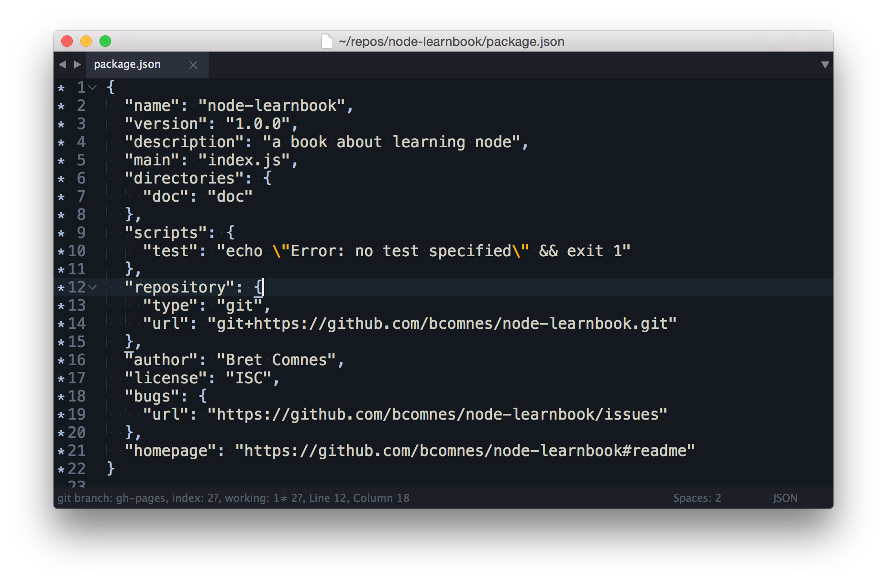](https://github.com/bcomnes/node-learnbook/blob/gh-pages/package.json)

The `package.json` is the source of truth about your module.  It describes critical aspects of the module, like the name, version, license and entry point into the program.

It is worth reading the `npm` docs page about this file in its entirety:

[Specifics of npm's package.json handling](https://docs.npmjs.com/files/package.json)

Here are some keys of interest:

- [`main`](https://docs.npmjs.com/files/package.json#main): this is the name of the entry point of your application.  When requiring the module, you get whatever this file `exports` or `module.exports`.  When reading a modules source code, this is the file you look at first.
- [`bin`](https://docs.npmjs.com/files/package.json#bin): sometimes modules will include a executable bin.  These get specified here.  These end up in the `./node_modules/.bin` folder and are available to the commands defined in the `scripts` field.  They also get installed to your `$PATH` if you installed with the `-g` flag.
- [`scripts`](https://docs.npmjs.com/misc/scripts): this is where you define scripts.  You should always include the following scripts in your module (if appropriate):
  - `test`: the command used to test your module
  - `start`: the command to run your module
- [`dependencies`](https://docs.npmjs.com/files/package.json#dependencies): these list off modules and their version ranges that your module needs in order to work.
- [`devDependencies`](https://docs.npmjs.com/files/package.json#devdependencies): these are modules needed to test, build and otherwise develop your module.  Dependencies that are not required at runtime should live here.  This includes all utility programs, test runners, task runners and build scripts.
- [`license`](https://docs.npmjs.com/files/package.json#license): This is the [SPDX license identifier](https://spdx.org/licenses/) for the module.  `npm` complains if you leave this out.

## `devDependencies` and `npm` scripts shield you from opinions.

*AKA, how to navigate the world of javascript development tools without going crazy.*

<a href="http://gruntjs.com/"></a><a href="http://gulpjs.com/"></a><a href="https://www.gnu.org/software/bash/"></a>

There are two factors to this problem.

- There are tons of new javascript development tools to choose from with cool looking logos that get people really excited.

- It isn't totally obvious what the best way to install and use these tools are.

### `tl;dr` of using build tools are:

1. Install and save them as `devDependencies` in your package.json (e.g. `npm i grunt --save-dev`)
2. Nail down the tool's project specific use in the `scripts` field.
3. Install the accompanying CLI with -g **only** when you feel the need to have it available system wide, and don't ever ask other developers to install a global tool for project specific use cases.

If a module comes with a `bin`, that ends up in the `.\node_modules\.bin` folder.  `.\node_modules\.bin` shouldn't be in your $PATH.  When `npm` runs a command out of the `.package.json` `scripts` field, it supplements the search path with `.\node_modules\.bin` so that they are available for use from that interface.

This can be referred to as `node_modules\.bin` PATH hoisting.

By hiding your toolchain behind a common interface, you shield yourself and other developers from these boring, toolchain details.  Nobody actually cares what tools you used when they are looking to make a fix or change to your module, and you are not doing anyone any favors by promoting your favorite tools in this context by asking people to install a `-g` tool to work on your module.

**Read this article to learn more:**

- [A Facade for Tooling with NPM Package Scripts](http://bocoup.com/weblog/a-facade-for-tooling-with-npm-scripts/)

### Grunt, Gulp, Broccoli... Bash?

>[](http://nodejsreactions.tumblr.com/post/82300463325/grunt-gulp-broccoli)
>
Grunt, Gulp, Broccoli --[nodejsreactions.tumblr.com](http://nodejsreactions.tumblr.com/post/82300463325/grunt-gulp-broccoli)

Not every project needs a full task runner.  Single purpose node utilities piped together with bash is a great way to get things done and should be considered.

- [Why we should stop using Grunt & Gulp](http://blog.keithcirkel.co.uk/why-we-should-stop-using-grunt/)
- [How to Use npm as a Build Tool](http://blog.keithcirkel.co.uk/how-to-use-npm-as-a-build-tool/)

Sometimes projects benefit from a task runner.  In these projects, use a task runner.

[](https://www.youtube.com/watch?v=YQwYNca4iog)

- https://gist.github.com/substack/8313379

### A tool of your own

When you decide you need a custom dev Tool, follow this general design process:

1. Write your tool as a node module that can be tested and consumed by other node modules, in a generic and independent way.
2. Write a CLI interface that consumes the library, and bundle it with the library (bonus points if you write it to accept [`stdin` so that it can be piped together](https://nodejs.org/api/process.html#process_process_stdin) with other tools.)
3. Finally, write a separate, ecosystem specific module that requires your generic library and provides the correct interface to grunt/gulp etc.

Step 3 is often optional.  Write these interface with task runners that you care about, and support contributors who want to write an task-runner specific interface for your module.

- https://github.com/jlevy/the-art-of-command-line
- https://github.com/alebcay/awesome-shell

## Utopia `npm`

Global and environmental dependencies are an anti-pattern because it adds endless complexity to the process of writing and deploying applications.

The `npm` community has some really big ideas about what `npm` can and could do better.  It has often been the tradition that you write a program, that talks to a web server like [apache](http://www.apache.org/) through [CGI](https://en.wikipedia.org/wiki/Common_Gateway_Interface) and also connects to a database that is assumed running.

These are all massive assumptions on your applications part.

Modern day ops teams have seen the value in codifying all of this server and service state using things like [chef](https://www.chef.io/chef/) and [puppet](https://puppetlabs.com/).  Automating servers to achieve the correct state so that your application can run is great, but your app is still getting bundled without vital organs to make it work.

Utopia `npm` is the idea that, with a working copy of `npm` and a project repository with a `package.json`, you can deploy your application by simply running the module's contract:

```
$ npm install ; npm test ; npm start
```

For example, instead of running a DB as a server, [LevelDB](https://github.com/google/leveldb) is consumed no differently than any other library in your application:

- [levelup](https://www.npmjs.com/package/levelup)
- [leveldb-handbook](https://github.com/substack/leveldb-handbook) (incomplete :cry:)

> Running a big, well-known database service has an ineffable heaviness to it: they bind to a custom port and the service must already be running before your program will work. Worse, if you install the database from a package manager like apt-get, the database will be auto-daemonized and put into your init scripts. Good luck hunting down where it decided to put the configuration file. -- substack: [leveldb-handbook](https://github.com/substack/leveldb-handbook)

Instead of downloading source dependencies and building them, they are packaged as pre-built binaries:

- [levelup](https://github.com/Level/levelup)
- [electron-prebuilt](https://github.com/mafintosh/electron-prebuilt)
- [go-ipfs](https://www.npmjs.com/package/go-ipfs)
- ...

These are just some examples of projects that facilitate packaging non-js assets as `npm` dependencies.  This is an important design principle to keep in mind when building apps and modules.  The more you can package into `npm`, the easier it will be to use your app or module.

While the above examples are great, practical examples of patterns we can use today, these ideas are much larger than just versioning everything with `npm`.

### JS.os?

[](http://xkcd.com/1508/)

<a href="https://node-os.com/"></a>

- [Node.OS](https://node-os.com/)
- [Runtime.js](http://runtimejs.org/)

[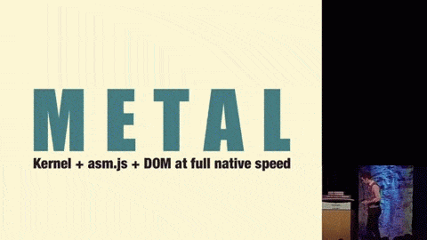](https://www.destroyallsoftware.com/talks/the-birth-and-death-of-javascript)

- [The Birth and Death of Javascript](https://www.destroyallsoftware.com/talks/the-birth-and-death-of-javascript)

# Semver

Semver is the versioning scheme of the `node` community.  Its not perfect, but it works mostly okay:

```
major.minor.patch
```

but you can also think about it like this

```
breaking.feature.bugfix
```

You start at version `1.0.0`, but sometimes people start modules at `0.0.1` to indicate :construction:experimental:construction: modules.

These links explain it pretty well.

- [Semantic Versioning 2.0.0](http://semver.org/)
  [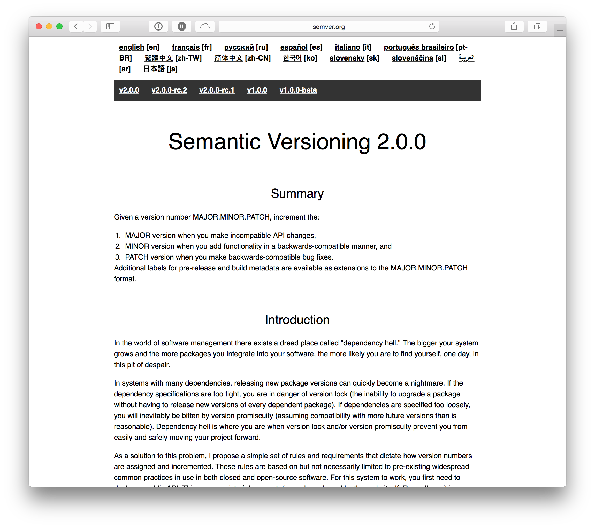](http://semver.org/)
- [Semver ftw!](http://semver-ftw.org/)
- [The semantic versioner for npm](https://docs.npmjs.com/misc/semver)
- [package.json#dependencies](https://docs.npmjs.com/files/package.json#dependencies)

In your `package.json`, you can specify your dependencies using semver ranges.

The default range is:

```
^version "Compatible with version" See semver(7)
```

This range (in theory), should get you module patches that improve or fix bugs, and don't "break" the module interface in a range.  In practice, sometimes they break anyway.  This is why tests are critical.

Tools exist to help facilitate this patching process:

- [next-update](https://www.npmjs.com/package/next-update): run your tests against available updates without touching the current dep versions.
  [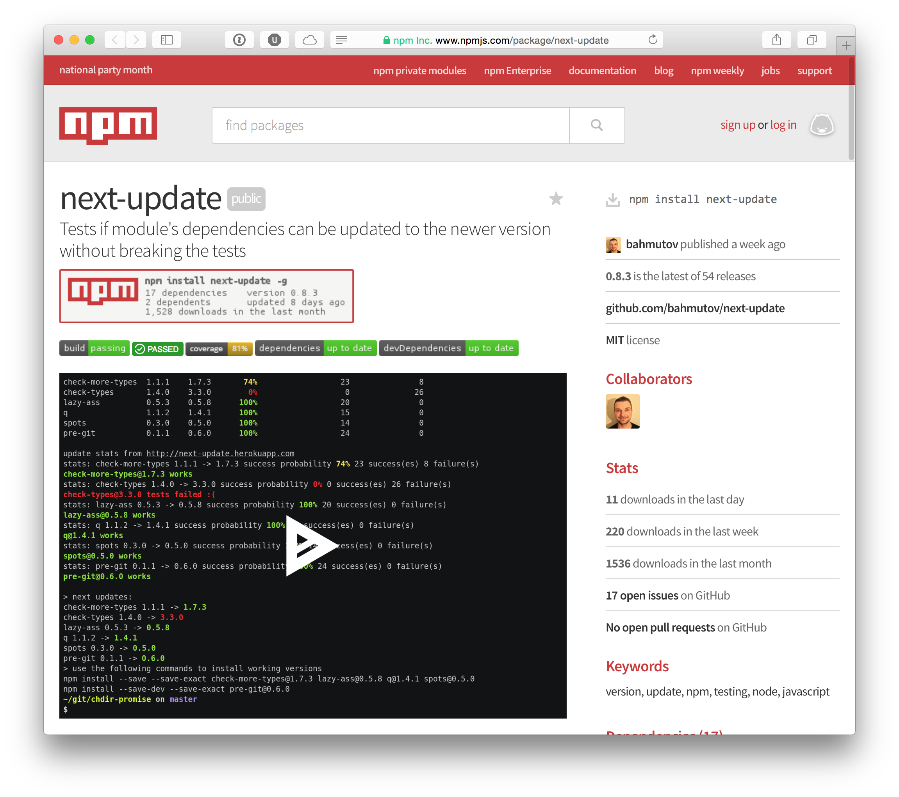](https://www.npmjs.com/package/next-update)
- [npm.click](http://npm.click/#/): inspect a `package.json` for outdated packages.
  [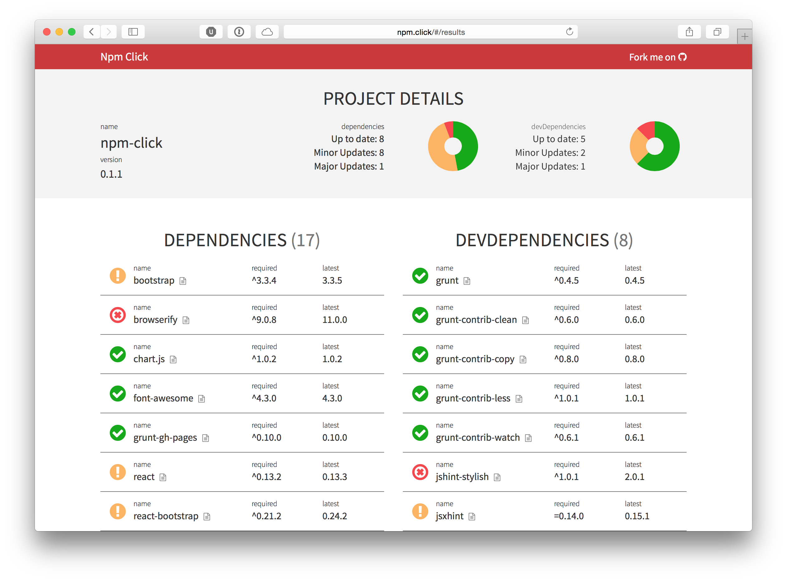](http://npm.click/#/)
- [David. DM](https://david-dm.org/): automatically fetches package versions status from a github url.
  [](https://david-dm.org/)
- [Semver Calculator](http://semver.npmjs.com)

This is an area that needs improvement and automation tools.

# ... [WIP]

Still pulling together the primordial ooze below.

# Node in the browser?

In node, you have access to the `require` keyword that lets you load modules out of your ethereal `node_modules` folder.  This lets you write your programs in tiny, reusable modules of code.

Browserify is a program that lets you write javascript programs using the `require` system.  Instead of running the resulting programs in `node`, browserify peforms a "build-step" and outputs a bundle that you serve up for a browser to run.

- [Browserify-handbook](https://github.com/substack/browserify-handbook)
- http://wzrd.in/
- https://github.com/thlorenz/browserify-shim#multi-shim-example-including-dependencies

Browserify's scope is fairly limited compared to traditional front-end frameworks, as a result there are quite a few other tools that do similar things plus a whole lot more.  Don't fall for it!  [YNGNI!](http://c2.com/cgi/wiki?YouArentGonnaNeedIt)  Except when you do.

- https://github.com/substack/browserify-handbook#browserify-middleware-enchilada

# Write your tests, clean your lint

A module isn't complete without tests.  Modules are fairly small, so 100% coverage is generally a modest goal to reach.

Tests force to you clearly define your module's interface, and allow for internal improvements to be made while ensuring external consumers don't break.

Testing your module will a mix of the following types of tools:

- Testing harness: some set of functions that keep track of how many tests are run and if they pass or fail.
- TAP Reporter: TAP is machine friendly.  TAP reporters are machines that make your TAP output human friendly.
- Assertion library: this provides set of functions that are used to compare what actually happened to what you want to happen.  Sometimes this comes along with the testing harness.
- Linter: This tool will perform static analysis on your code and point out mistakes, syntax errors, code smells or style issues.
- Formatter: Formats code so that its is formatted consistently.
- Continuous Integration (CI): You run your tests as you develop the module, but you can also have free services test your code for you.
- Coverage: Running your coverage tools along with your tests lets you keep track of which portion of your code is tested.

## `tape` it down

[](https://www.npmjs.com/package/tape)

There are a lot of testing frameworks out there.  For most modules, [tape](https://github.com/substack/tape) is a great choice.  It's similar to writing tests in other languages like `go` and `python` so your ability to write tests will remain portable.

Here are some reasons why `tape` is great:

- Test results are output as [TAP](https://testanything.org/)
- Works in a browser, so you can test for browser compatibility
- Works like any other module.  You install it and require it into your test files.
- Does not introduce non-standard language keywords, like `describe`
- Provides a conservative but usefdul set of test assertions by default
- Does not extend default object prototypes in your testing environment
- Very stable, simple and complete

Some links on using tape:

- [tape's readme](http://npmjs.com/tape)
- [how I write tests for node and the browser - substack](http://substack.net/how_I_write_tests_for_node_and_the_browser)
- [testling on tape](https://ci.testling.com/guide/tape)

Here's some tape tests

```js
var test = require('tape')

var testString = 'normally i would be imported too'
function foo() {
  return testString
}

test('lets test the foo function', function(t) {
  setTimeout(function() {
    t.equal(foo(), testString, 'foo() returns testString')
  }, 100)
})

test('lets test the foo function', function(t) {
  t.notEqual(foo(), 'boop', 'foo() returns testString')
})
```

- [finnp/node-travisjs](https://github.com/finnp/node-travisjs)


# Event Emitters

Where do I go to learn these?

# Inheritance, Composition, and the Prototype Chain

AKA OO AKA Object Oriented, AKA :ghost::ghost: programming in Javascript.  Also prototypes.

OO Programming is a way of organizing and writing code that breaks code up into "classes" that allow you to create object factories that create object instances that have instance specific properties and methods (aka a property of an object that is a function).

JavaScript doesn't subscribe to the purely object oriented world-view like other language (e.g. Java or Objective C).  Object orientation is a valid, common and occasionally ideal way to organize code, but other times its not necessary.

Javascript lets you write code in a object oriented way.  In fact, it lets you do it a number of different ways.  This is a blessing, and a curse.  While it allows for OO, often in a less verbose syntax than pure OO languages, you will have to learn all the different ways of writing OOJS in order to really do it effectively, as well as read code of other authors.

More often than not, you will find popular javascript libraries opt for the less ideal OO style for some reason.  There is no good explanation for this other than OO programming is currently a predominant coding paradigm, and certain OO JS styles resemble classical OO more than other more ideal OOJS styles.

Its best to try to understand all the different OO styles, their strengths and weaknesses, and mix and match the parts that work with the problem domain you are attempting to solve.

[Douglas Crockford](http://www.crockford.com) wrote the book on the different types of object oriented inheritance you can have in JavaScript in 2008, and he boils it down to three types:  **(Pseudo)classical**, **Prototypal**, and **Functional**.  This breakdown is required reading and can be found in [JavaScript: The Good Parts](#javascript-the-good-parts).

[Eric Elliott](http://ericleads.com) revisits this issue in 2014 and breaks this issue down even more in [Programming JavaScript Applications](http://chimera.labs.oreilly.com/books/1234000000262/index.html)(Now a free e-book!)  Eric identifies the techniques used in each of Doug's OO styles, explains how they work and what they are good and not so good for, and introduces **Fluent-Style** JavaScript and the concepts of [stamps](https://github.com/stampit-org/stampit).

[](http://chimera.labs.oreilly.com/books/1234000000262/index.html)

While its worth reading Eric and Doug's take on OOJS, lets check out a quick reference of the different strategies.

- https://medium.com/javascript-scene/what-is-webassembly-the-dawn-of-a-new-era-61256ec5a8f6
- https://medium.com/javascript-scene/the-two-pillars-of-javascript-ee6f3281e7f3
- https://medium.com/javascript-scene/the-two-pillars-of-javascript-pt-2-functional-programming-a63aa53a41a4
- https://medium.com/javascript-scene/common-misconceptions-about-inheritance-in-javascript-d5d9bab29b0a

## (Pseudo)Classical

## Prototypical

## Functional

## Mixing the three

# Whats the deal with Streams?

- [Streams handbook](https://github.com/substack/stream-handbook)
  > Streams can help to separate your concerns because they restrict the implementation surface area into a consistent interface that can be reused.
- [through](https://github.com/dominictarr/through)
- [through2](https://github.com/rvagg/through2)
- [duplexify](https://github.com/mafintosh/duplexify) - asynchronously assign readable and writable
- [on streams1 vs 2-3](https://github.com/dominictarr/through/issues/37#issuecomment-129340097)
- [pull stream](https://github.com/dominictarr/pull-stream)
- [stephenplusplus/stream-faqs](https://github.com/stephenplusplus/stream-faqs)
- https://nodejs.org/en/blog/feature/streams2/
- https://dl.dropboxusercontent.com/u/3685/presentations/streams2/streams2-ko.pdf
- https://iojs.org/api/stream.html
- https://nodejs.org/api/stream.html
- https://github.com/nodejs/readable-stream
- https://strongloop.com/strongblog/whats-new-io-js-beta-streams3/
- http://stackoverflow.com/questions/21538812/what-is-streams3-in-node-js-and-how-does-it-differ-from-streams2
- https://github.com/joyent/node/issues/5860
- https://nodejs.org/docs/v0.11.5/api/stream.html
- http://brycebaril.github.io/streams2-presentation/#/21/7
- https://www.npmjs.com/package/through2-spy
- https://www.npmjs.com/package/stream-meter
- https://github.com/brycebaril/node-stream-spigot
- https://www.npmjs.com/package/through2
- https://www.npmjs.com/package/through2-filter
- https://www.npmjs.com/package/stream-spigot#star
- https://twitter.com/rvagg/status/608577853601398784
- https://iojs.org/api/stream.html#stream_simplified_constructor_api
- http://words.jessekeane.me/front-end-streams/
- https://cloud.githubusercontent.com/assets/37303/5728694/f9a3e300-9b20-11e4-9e14-a6938b3327f0.png
- https://github.com/calvinmetcalf/streams-a-love-story
- http://streams.how/
- https://nodesource.com/blog/understanding-object-streams/
- http://dominictarr.com/post/145135293917/history-of-streams

# What makes modules small(µ)?

- http://substack.net/node_aesthetic
- http://substack.net/many_things
- https://github.com/Raynos/http-framework
- http://maxogden.com/a-month-of-modules.html
- http://substack.net/finding_modules
- https://github.com/substack/node-mkdirp/blob/master/index.js
- http://www.ustream.tv/recorded/46670615
- https://gist.github.com/substack/68f8d502be42d5cd4942
- https://en.wikipedia.org/wiki/Turtles_all_the_way_down
- https://gist.github.com/substack/5075355
- http://0fps.net/2013/01/22/commonjs-why-and-how/
- https://en.wikipedia.org/wiki/Modular_programming
- https://gist.github.com/dominictarr/2401787
- https://github.com/felixge/node-style-guide
- http://www.quora.com/Whats-the-correct-way-to-write-nodejs-modules-There-seems-to-be-discrepancies-between-experts-like-substack-dominictarr-vs-the-newd-constructor-style-of-V8-optimization-recommendations-What-gives
- https://github.com/openopensource/openopensource.github.io
- https://github.com/ngoldman/open-2-contributing
- https://github.com/yoshuawuyts/knowledge
- https://github.com/npm-dom

> When applications are done well, they are just the really application-specific, brackish residue that can't be so easily abstracted away. All the nice, reusable components sublimate away onto github and npm where everybody can collaborate to advance the commons. -- [James Halliday-substack.net/how_I_write_modules](http://substack.net/how_I_write_modules)

# Node.js and io.js Anthropology

- http://blog.izs.me/post/104685388058/io-js
- https://gist.github.com/maxogden/d96123138522c84cdb25
- http://tableflip.io:1234/
- https://github.com/iojs/io.js/issues/37
- https://nodesource.com/blog/was-this-trip-really-necessary
- https://twitter.com/rvagg/status/598605393636429825
- https://twitter.com/mikeal/status/598595967928008705
- https://github.com/nodejs/node
- https://www.youtube.com/watch?v=UbYiFLf7MpU
- https://github.com/nodejs/io.js/issues/1664#issuecomment-101828384
- https://www.youtube.com/watch?v=hZJCnT7E1ts
- http://tableflip.io:12345/

# Tools to write Node

# Spellcheck for Javascript

# All the badges

# Hex Stickers

[](https://github.com/terinjokes/StickerConstructorSpec)

To be consistent with node's emphasis on small, interchangeable modules, somehow a hex sticker specification was created.  Other than looking super cool, and evenly dividing up valuable laptop surface real estate, one could understand hex stickers as node conventions actualizing as a distributed, shared community culture/art project.  By following a few simple, basic rules, everyone can create an interesting and useful piece of the puzzle that works nicely together to make up the whole while progressing the commons.  In this case, tessellating stickers across a laptop or water bottle without any wasted space!

[](http://nodeschool.io/hexdex.html)

[Nodeschool's Hexdex](http://nodeschool.io/hexdex.html)

[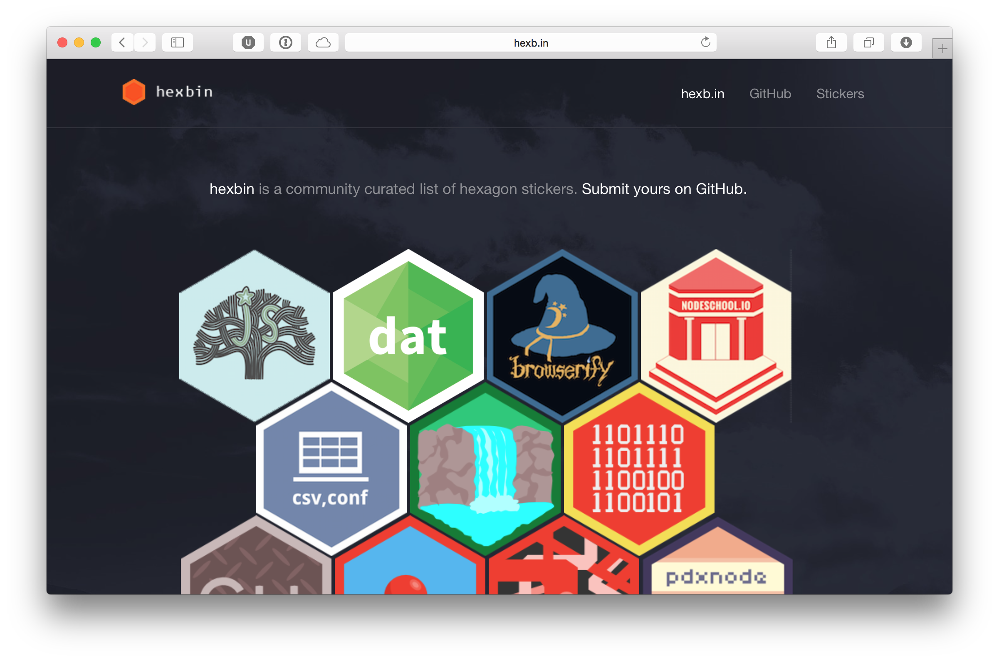](http://hexb.in/)

[Hexb.in](http://hexb.in/) Hex sticker registry

## A hex sticker of your own

It's pretty easy to make hex stickers.

- [stickermule.com](https://www.stickermule.com/): Order die-cut stickers and ensure that they understand the correct dimensions of the stickers.
- [hexi.pics](https://hexi.pics/help_en): a website dedicated to creating hex stickers.  Lets you trivially create hex stickers and order them.
  [](https://hexi.pics/)

## Hex Sticker Standard

Oh yes.  You heard right, a sticker standard.

[](http://terinjokes.github.io/StickerConstructorSpec/)

[Stickers Standard](http://terinjokes.github.io/StickerConstructorSpec/)

[“How standards are made on small scale”](http://dybskiy.com/laptop-sticker-standard/): A nice little history of the spec.

> We quickly agreed that there should be a standard for them and that the most useful one seems to be 2”x1.75” hexagons. I tweeted it and the reaction was way more amazing than I expected.

[](https://www.flickr.com/photos/bretc/21399375139/in/dateposted-public/)

[](http://hexb.in/sticker.html)

# An adventure of your own

Resources for teaching others and writing nodeschool adventures.

# JS is the worlds polyglot assembly language now

- http://bellard.org/jslinux/
- https://github.com/jashkenas/coffeescript/wiki/List-of-languages-that-compile-to-JS
- https://brendaneich.com/2015/06/from-asm-js-to-webassembly/
- https://medium.com/javascript-scene/what-is-webassembly-the-dawn-of-a-new-era-61256ec5a8f6
- https://medium.com/javascript-scene/why-we-need-webassembly-an-interview-with-brendan-eich-7fb2a60b0723

# ES6 and Beyond

- https://medium.com/@brianleroux/es6-modules-amd-and-commonjs-c1acefbe6fc0
- http://espadrine.github.io/New-In-A-Spec/es6/
- https://en.wikipedia.org/wiki/ECMAScript
- http://blog.izs.me/post/25906678790/on-es-6-modules
- http://tomdale.net/2012/01/amd-is-not-the-answer/

# Frameworks

- http://lebron.technology/
- http://hapijs.com/
- http://expressjs.com/
- https://github.com/Raynos/http-framework
- https://github.com/Raynos/mercury
- https://jshttp.github.io/

# Haters gonna hate

[](http://nodejsreactions.tumblr.com/post/74845429937/every-why-node-js-sucks-article-ever)

> Every “why Node.js sucks” article ever --[nodejs reactions](http://nodejsreactions.tumblr.com/post/74845429937/every-why-node-js-sucks-article-ever)

Node has its share of weak points.  Articles that hate on it generally miss these points.  A good way to learn about a tool is to analyze its criticism.  Does it have merit?  Is it correct?  Is the the stated issue as bad as the critic makes it out to be?

- [](https://www.youtube.com/watch?v=1e1zzna-dNw)

  [Biz of Tech: Node.JS Is Stupid And If You Use It So Are You](https://www.youtube.com/watch?v=1e1zzna-dNw)

# html + css

- Dive into html5
- HTML5 and css Jon Ducket

# Community

- irc
- github
- twitter
- conferences
- gitter/slack?
- http://lin-clark.com/blog/2014/07/01/authoring-nodejs-workshopper-lessons/
- http://nodeschool.io/

# Mastering git

- orily git
- git for 5 year olds

# Electron?

- yay desktop apps
- [electron handbook](https://github.com/bcomnes/electron-handbook)
- https://github.com/sindresorhus/awesome-electron

# Sharing your ideas

:sunglasses:

- http://www.macwright.org/big/
- https://github.com/maxogden/slides


## School of Substack

- https://www.youtube.com/watch?v=84PE6EF3YWY&list=FLd8cLeIEVcsbhyX9FDph-Jg&index=3
- https://github.com/substack/dnode
- https://github.com/substack/upnode
- https://github.com/substack/fleet
- https://github.com/substack/seaport
- http://substack.net/multi_server_continuous_deployment_with_fleet
- http://substack.net/semver_your_services_with_seaport
- http://substack.net/shared_rendering_in_node_and_the_browser

# Native addons

- https://medium.com/@nodesource/c-add-ons-for-node-js-v4-be5d48832933

# IRC

- https://gist.github.com/maxogden/8610086
- http://nodeirc.info
- http://blog.izs.me/post/30036893703/policy-on-trolling

# Link Dump

This document was created  after amassing a large collection of node related links helpful to learning and understanding node.  Here is a partial linkdump until the rest of the guide can be written.


- http://nikhilm.github.io/uvbook/threads.html#core-thread-operations
- https://github.com/nodejs/node-v0.x-archive/issues/5132#issuecomment-15432598
- https://github.com/sindresorhus/awesome
- https://github.com/sindresorhus/awesome-nodejs
- https://gist.github.com/staltz/868e7e9bc2a7b8c1f754
- https://github.com/kriskowal/gtor
- https://gist.github.com/jhclark/2845836
- http://i.imgur.com/k0t1e.png
- https://github.com/essdot/js-lessons
- https://github.com/shama/base-element
- http://coodict.github.io/javascript-in-one-pic/
- https://github.com/hughsk/disc
- https://github.com/reddit/reddit-mobile/issues/247
- http://www.finnpauls.de/streams-editor/
- https://github.com/finnp/streams-editor
- http://dominictarr.com/post/25516279897/why-you-should-never-write-a-package-manager
- https://gist.github.com/chrisdickinson/0a236ce62097c806113d#file-wip-md
- https://gist.github.com/rgbkrk/91b40941a38daf700e61
- http://browserify.org/articles.html
- https://medium.com/@mjackson/universal-javascript-4761051b7ae9
- http://www.learnenough.com/command-line
- https://certsimple.com/blog/deploy-node-on-linux
- https://github.com/denysdovhan/bash-handbook
- http://mafintosh.com/learning-javascript.html
- https://gist.github.com/chrisdickinson/3212df99d53851261597
- https://git.cryto.net/Squatconf/Talks/src/master/accepted/day2/lessons-learned-presentation.md
- https://github.com/felixrieseberg/windows-build-tools
- https://github.com/a0viedo/demystifying-js-engines
- https://nolanlawson.com/2016/08/15/the-cost-of-small-modules/
- https://medium.com/@Rich_Harris/small-modules-it-s-not-quite-that-simple-3ca532d65de4#.tlkjx37nj
- https://github.com/ahdinosaur/mad-science-handbook
- https://nodesource.com/blog/eleven-npm-tricks-that-will-knock-your-wombat-socks-off/
- https://web.archive.org/web/20160903203552/https:/twitter.com/izs/status/764295673625784320
- https://github.com/nodejs/node/commit/da2f4b2dc429df120188c5633ac3bd6f4a3c5373
- https://gwenbell.com/dt-interview/
